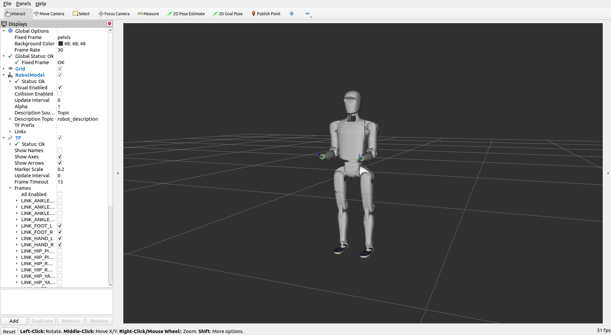
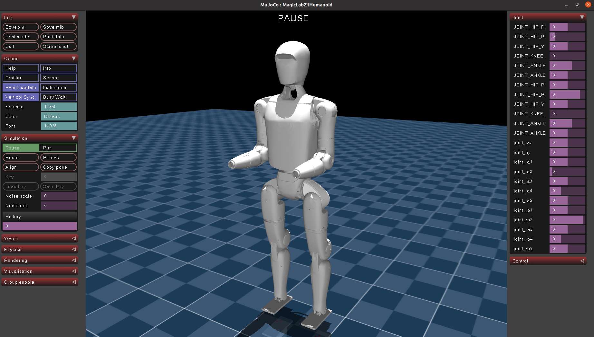

# Magicbot-Z1 Description (URDF & MJCF)

## Overview

This package includes a universal humanoid robot description (URDF & MJCF) for the [Magicbot-Z1](https://www.magiclab.top/z1), developed by Magiclab Robotics.

<table>
  <tr>
    <td></td>
    <td></td>
  </tr>
</table>

Magicbot-Z1 Humanoid have 24 joints:

```text
root [⚓] => /pelvis/
    JOINT_HIP_PITCH_L [⚙+Y] => /LINK_HIP_PITCH_L/
        JOINT_HIP_ROLL_L [⚙+X] => /LINK_HIP_ROLL_L/
            JOINT_HIP_YAW_L [⚙+Z] => /LINK_HIP_PITCH_L/
                JOINT_KNEE_PITCH_L [⚙+Y] => /LINK_KNEE_PITCH_L/
                    JOINT_ANKLE_PITCH_L [⚙+Y] => /LINK_ANKLE_PITCH_L/
                        JOINT_ANKLE_ROLL_L [⚙+X] => /LINK_ANKLE_ROLL_L/
    JOINT_HIP_PITCH_R [⚙+Y] => /LINK_HIP_PITCH_R/
        JOINT_HIP_ROLL_R [⚙+X] => /LINK_HIP_ROLL_R/
            JOINT_HIP_YAW_R [⚙+Z] => /LINK_HIP_YAW_R/
                JOINT_KNEE_PITCH_R [⚙+Y] => /LINK_KNEE_PITCH_R/
                    JOINT_ANKLE_PITCH_R [⚙+Y] => /LINK_ANKLE_PITCH_R/
                        JOINT_ANKLE_ROLL_R [⚙+X] => /LINK_ANKLE_ROLL_R/
    joint_wy [⚙+Z] => /link_wy/
        joint_hy [⚙+Z] => /link_hy/
        joint_la1 [⚙+Y] => /link_la1/
            joint_la2 [⚙+X] => /link_la2/
                joint_la3 [⚙+Z] => /link_la3/
                    joint_la4 [⚙+X] => /joint_la4/
                        joint_la5 [⚙+Z] => /link_la5/
        joint_ra1 [⚙+Y] => /link_ra1/
            joint_ra2 [⚙+X] => /link_ra2/
                joint_ra3 [⚙+Z] => /joint_ra3/
                    joint_ra4 [⚙+X] => /link_ra4/
                        joint_ra5 [⚙+Z] => /link_ra5/
```
## Usages

### RViz
```bash
sudo apt install ros-humble-joint-state-publisher-gui
cd magicbot-z1_description
colcon build
source install/setup.bash
ros2 launch magicbot-z1_description view.launch.py 
```

### MuJoCo
```bash
pip install mujoco
cd magicbot-z1_description
python3 -m mujoco.viewer --mjcf=mjcf/MAGICBOTZ1.xml
```
