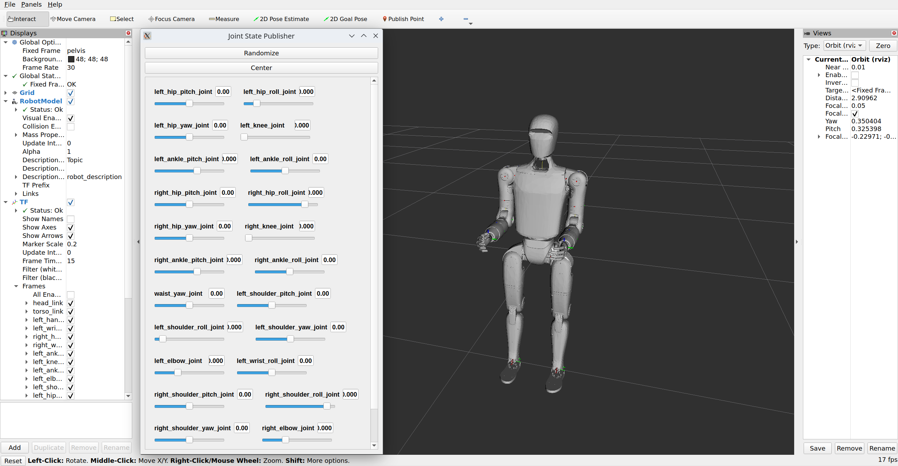
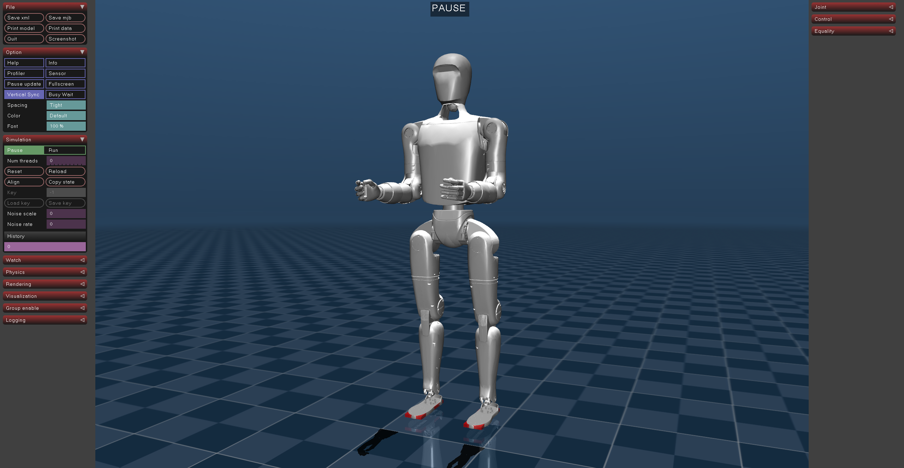

# Magicbot-Z1 Description (URDF & MJCF)

## Overview

This package includes a universal humanoid robot description (URDF & MJCF) for the [Magicbot-Z1](https://www.magiclab.top/z1), developed by Magiclab Robotics.

<table>
  <tr>
    <td></td>
    <td></td>
  </tr>
</table>

Magicbot-Z1 Humanoid have 24 joints:

```text
root [⚓] => /pelvis/
    left_hip_pitch_joint [⚙+Y] => /left_hip_pitch_link/
        left_hip_roll_joint [⚙+X] => /left_hip_roll_link/
            left_hip_yaw_joint [⚙+Z] => /left_hip_pitch_link/
                left_knee_joint [⚙+Y] => /left_knee_link/
                    left_ankle_pitch_joint [⚙+Y] => /left_ankle_pitch_link/
                        left_ankle_roll_joint [⚙+X] => /left_ankle_roll_link/
    right_hip_pitch_joint [⚙+Y] => /right_hip_pitch_link/
        right_hip_roll_joint [⚙+X] => /right_hip_roll_link/
            right_hip_yaw_joint [⚙+Z] => /right_hip_yaw_link/
                right_knee_joint [⚙+Y] => /right_knee_link/
                    right_ankle_pitch_joint [⚙+Y] => /right_ankle_pitch_link/
                        right_ankle_roll_joint [⚙+X] => /right_ankle_roll_link/
    waist_yaw_joint [⚙+Z] => /torso_link/
        head_joint [⚙+Z] => /head_link/
        left_shoulder_pitch_joint [⚙+Y] => /left_shoulder_pitch_link/
            left_shoulder_roll_joint [⚙+X] => /left_shoulder_roll_link/
                left_shoulder_yaw_joint [⚙+Z] => /left_shoulder_yaw_link/
                    left_elbow_joint [⚙+X] => /left_elbow_joint/
                        left_wrist_yaw_joint [⚙+Z] => /left_wrist_yaw_link/
        right_shoulder_pitch_joint [⚙+Y] => /right_shoulder_pitch_link/
            right_shoulder_roll_joint [⚙+X] => /right_shoulder_roll_link/
                right_shoulder_yaw_joint [⚙+Z] => /right_shoulder_yaw_joint/
                    right_elbow_joint [⚙+X] => /right_elbow_link/
                        right_wrist_yaw_joint [⚙+Z] => /right_wrist_yaw_link/
```
## Usages

### RViz
```bash
sudo apt install ros-humble-joint-state-publisher-gui
cd magicbot-z1_description
colcon build
source install/setup.bash
ros2 launch magicbot-z1_description view.launch.py 
```

### MuJoCo
```bash
pip install mujoco
cd magicbot-z1_description
python3 -m mujoco.viewer --mjcf=mjcf/MAGICBOTZ1.xml
```
